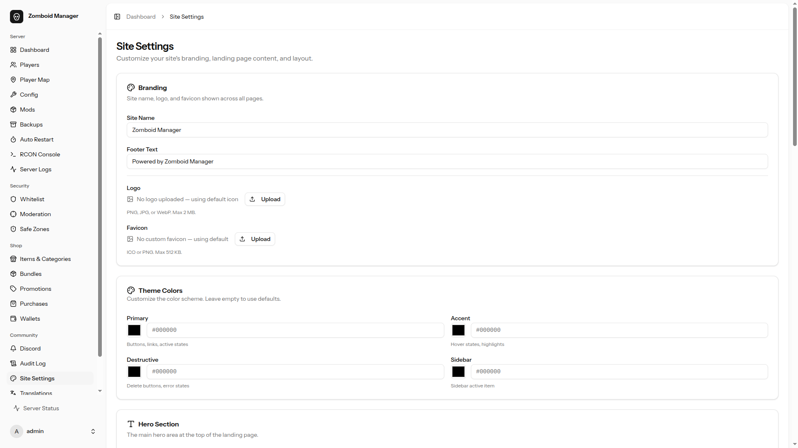
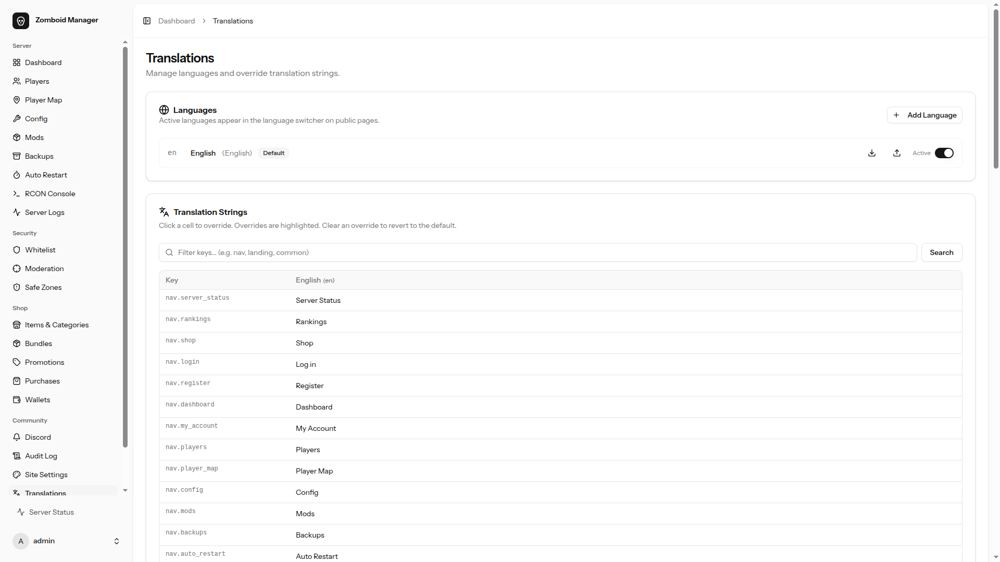
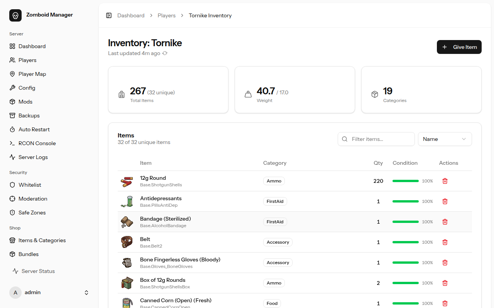
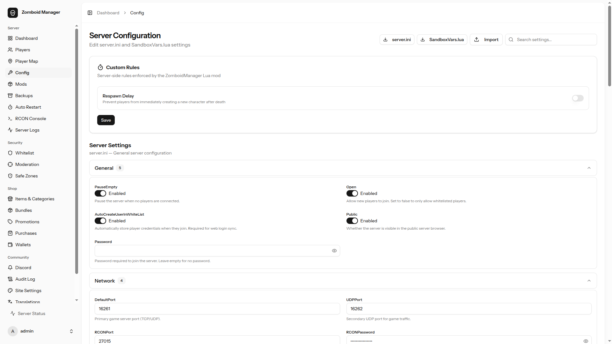
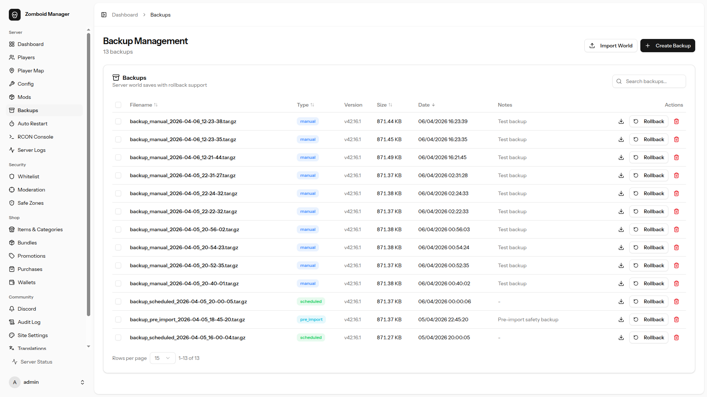

<div align="center">


# Zomboid Manager

**Full-stack web panel for managing a Project Zomboid dedicated server.**

[](https://laravel.com)
[](https://react.dev)
[](https://typescriptlang.org)
[](https://tailwindcss.com)
[](https://postgresql.org)
[](https://docs.docker.com/compose/)
[](LICENSE)

[Features](#features) · [Quick Start](#quick-start) · [Docs](#documentation) · [Screenshots](#screenshots) · [API Reference](#rest-api-reference) · [Architecture](#architecture) · [Security](#security)

</div>

---

## Overview

Zomboid Manager wraps a Dockerized Project Zomboid dedicated server with a Laravel REST API and a React + Inertia.js web dashboard. It provides remote management through three integration points:

- **RCON** — Source RCON TCP protocol for real-time player commands, broadcasts, and saves
- **Docker Engine API** — Container lifecycle control (start, stop, restart, update) via the Docker socket
- **File I/O** — Direct read/write access to PZ config files (`server.ini`, sandbox Lua) mounted from the game server volume

21 admin pages, a public status page, player portal, item shop, 40+ API endpoints, Discord notifications, an interactive player map, inventory management, safe zones, site customization, i18n, and more — all from a browser.

## Feature Status

| Area | Status | Notes |
|---|---|---|
| Docker Infrastructure | Done | Multi-arch (ARM64 + AMD64), auto-detection |
| RCON Integration | Done | Custom PHP Source RCON client |
| Server Control | Done | Start, stop, restart, save, wipe, update |
| Configuration Editor | Done | server.ini + sandbox Lua, categorized UI |
| Player Management | Done | Kick, ban, teleport, access levels, XP, god mode |
| Mod Management | Done | Steam Workshop integration, drag-and-drop reorder |
| Backup & Rollback | Done | Manual + scheduled, retention policies, queue-based |
| Whitelist | Done | CRUD + sync with PZ's SQLite `serverPZ.db` |
| Audit Logging | Done | Every admin action logged with user, IP, payload |
| Web Dashboard | Done | React 19 + Inertia.js v2 + shadcn/ui |
| Interactive Player Map | Done | Leaflet with live player markers |
| Inventory Management | Done | Browse, give, remove items with 1,100+ icons |
| Discord Webhooks | Done | 25+ configurable event notifications |
| Safe Zones | Done | PvP-free areas with violation tracking |
| Respawn Delay | Done | Configurable cooldown after death |
| Moderation & Events | Done | PvP violations, event log, player action history |
| RCON Console | Done | Browser-based console with command history |
| Server Logs | Done | Live log viewer with filtering |
| Authentication | Done | Fortify sessions, Sanctum tokens, API keys, 2FA |
| User Settings | Done | Profile, password, appearance, two-factor setup |
| Public Status Page | Done | Live server status, player count, uptime |
| Welcome Page | Done | Public landing with stats, podium, feature overview |
| Rankings | Done | Public leaderboard with 6 stat categories |
| Player Portal | Done | Player dashboard with account info and map position |
| Auto Restart | Done | Scheduled daily restarts with countdown warnings |
| Item Shop & Wallet | Done | Browse, purchase items/bundles, promo codes, wallet |
| Shop Admin (Items, Bundles, Promotions) | Done | Full CRUD for items, categories, bundles, promos |
| Purchase History & Wallets | Done | Admin views for purchases, delivery tracking, wallet management |
| In-Game Money Deposit | Done | Convert Base.Money/MoneyBundle to wallet coins via Lua bridge |
| Lua Bridge Mod | Done | Server-side enforcement for safe zones + respawn |
| Site Customization | Done | Branding, logo/favicon, hero content, feature cards, section layout |
| Theme Colors | Done | Admin-configurable color scheme (hex to oklch) |
| i18n / Translations | Done | Dynamic languages, JSON import/export, DB overrides, language switcher |

## Features

### Site Customization & i18n

Admin-editable site settings at `/admin/site-settings`: site name, logo/favicon upload, footer text, hero section content, feature cards (up to 8 with icon picker), landing page section visibility and ordering, and theme color customization (hex color picker with automatic oklch conversion). Full internationalization system at `/admin/translations`: dynamic language management, JSON file defaults with database overrides, JSON import/export for offline translation workflow, and a language switcher on public pages. Georgian font (Noto Sans Georgian) included.

<details>
<summary>Screenshots</summary>



</details>

### Welcome Page

Public landing page with live server status, community stats (total players, zombie kills, hours survived, deaths), a top survivors podium, and a feature overview. Sections render in admin-configured order; disabled sections are hidden. All content is editable from the Site Settings admin page. No login required.

<details>
<summary>Screenshot</summary>


</details>

### Server Control

Start, stop, restart, save, wipe, and update the game server from the dashboard. Scheduled actions dispatch countdown warnings to in-game players before executing. Server updates pull the latest build via SteamCMD. Wipe requires double confirmation and creates a pre-wipe backup automatically.

### Dashboard

Real-time server overview: online status, player count, game time, uptime, memory usage, game version, and a player leaderboard.

<details>
<summary>Screenshot</summary>


</details>

### Player Management

Full player table with search and filtering. Per-player actions: kick, ban/unban, set access level (admin, moderator, overseer, GM, observer, none), teleport, give items, add XP, toggle god mode. View detailed player profiles with stats and inventory links.

<details>
<summary>Screenshot</summary>


</details>

### Interactive Player Map

Leaflet-based map rendered from PZ map tiles. Live player markers with position tracking. Click a player to view details or take action. Supports zoom levels and coordinates display.

<details>
<summary>Screenshot</summary>


</details>

### Inventory Management

Browse a player's inventory with visual item icons (1,100+ icons sourced from PZwiki). Give items to online players via RCON with delivery status tracking. Remove items through the Lua bridge. Search and filter the item database.

<details>
<summary>Screenshot</summary>


</details>

### Configuration Editor

Edit `server.ini` and sandbox settings from the browser. Settings are organized into categories with descriptions, input validation, and type-appropriate controls (toggles, sliders, dropdowns). Changes require a server restart to take effect — the UI prompts for it.

<details>
<summary>Screenshot</summary>


</details>

### Mod Management

Add mods by Steam Workshop ID. The system keeps `WorkshopItems=` and `Mods=` lines in sync (paired entries, semicolon-separated). Drag-and-drop load order reordering. Remove mods with a single click. Requires a restart to apply.

<details>
<summary>Screenshot</summary>


</details>

### Backup & Rollback

Create manual backups or configure scheduled backups with per-type retention policies. Backups are created as queue jobs to avoid blocking the UI. Rollback to any previous backup with automatic pre-rollback snapshot. Backup types: manual, scheduled, pre-rollback, pre-update.

<details>
<summary>Screenshot</summary>


</details>

### Whitelist Management

CRUD operations on the PZ whitelist stored in `serverPZ.db` (SQLite). Add, remove, and toggle player entries. Sync the whitelist from the game server's live database. Configure auto-whitelist behavior.

<details>
<summary>Screenshot</summary>


</details>

### Safe Zones

Define PvP-free rectangular zones on the map with coordinates. The Lua bridge mod enforces zones server-side. Violations are tracked with attacker/victim details, zone info, strike count, and coordinates. Resolve violations by dismissing or taking action. Toggle the entire system on/off.

<details>
<summary>Screenshot</summary>


</details>

### Moderation & Events

Centralized moderation view showing PvP violations, safe zone events, and player action history. Filter by player, zone, or event type. Escalating strike system for repeat offenders.

<details>
<summary>Screenshot</summary>


</details>

### RCON Console

Browser-based RCON console with command history. Send any RCON command and see the response in real time. Autocomplete for common commands.

<details>
<summary>Screenshot</summary>


</details>

### Server Logs

Live server log viewer with auto-refresh. Filter logs by type and search within log content. View logs from the game server's output directly in the browser.

<details>
<summary>Screenshot</summary>


</details>

### Audit Logging

Every admin action is recorded with: timestamp, user, action type, IP address, and full request payload. Browse, search, and filter the audit trail from the admin panel.

<details>
<summary>Screenshot</summary>


</details>

### Discord Webhooks

25+ configurable Discord webhook notifications across server control, backup management, player actions, safe zone events, and respawn delay changes. Per-event toggle. Test webhook delivery from the settings page. Rich embeds with color-coded categories and emoji.

<details>
<summary>Screenshot</summary>


</details>

### Item Shop

Browse and purchase in-game items and bundles with a virtual wallet. Categories, search, featured items, promotional codes with percentage/fixed discounts. Purchase history and wallet transaction log. Admin panel for managing items, categories, bundles, promotions, and player wallets.

<details>
<summary>Screenshot</summary>


</details>

### Shop Admin — Items & Categories

Admin interface for managing shop items and categories. Set prices, quantities, stock limits, featured status, and assign categories. Full CRUD with inline editing.

<details>
<summary>Screenshot</summary>


</details>

### Shop Bundles

Create and manage item bundles with percentage discounts. Each bundle contains multiple shop items with automatic price calculation showing savings.

<details>
<summary>Screenshot</summary>


</details>

### Shop Promotions

Create discount codes and automatic promotions with percentage or fixed-amount discounts, usage limits, and expiration dates.

<details>
<summary>Screenshot</summary>


</details>

### Shop Purchases

Admin view of all player purchases with delivery status tracking, revenue stats, and filtering. Shows item delivery details including partial deliveries and failures.

<details>
<summary>Screenshot</summary>


</details>

### Wallet Management

Admin panel for managing player currency balances. View total circulation, per-player balances, earnings, and spending. Adjust balances manually when needed.

<details>
<summary>Screenshot</summary>


</details>

### In-Game Money Deposit

Players deposit `Base.Money` (1 coin) and `Base.MoneyStack` (10 coins) looted from zombies into their web wallet. Click "Deposit" on the shop page, the Lua bridge removes money items from inventory within ~15 seconds, and the wallet is credited within 5 minutes.

<details>
<summary>Screenshot</summary>


</details>

### Authentication & Security

- **Web auth** — Laravel Fortify with session-based login
- **Two-factor authentication** — TOTP with QR code setup, manual key entry, and recovery codes
- **API auth** — API key via `X-API-Key` header for programmatic access
- **Token auth** — Laravel Sanctum for token-based API access
- **Role-based access** — Admin middleware protects all management routes

### User Settings

Four settings pages: profile (name, email), password, two-factor authentication setup, and appearance (theme/dark mode).

### Public Status Page

Unauthenticated server status page showing: online/offline state, current player count, player list, server name, map, and uptime. Designed for sharing with the community.

<details>
<summary>Screenshot</summary>


</details>

### Rankings

Public leaderboard with six tabs: zombie kills, hours survived, deaths, kills/death ratio, hours/death ratio, and PvP kills/death. Community stats summary at the top. No login required.

<details>
<summary>Screenshot</summary>


</details>

### Player Portal

Authenticated player dashboard showing game account details (username, whitelist status, server status), profile settings links, and an interactive map with the player's last known position.

<details>
<summary>Screenshot</summary>


</details>

### Auto Restart

Schedule daily restart times with timezone support, configurable in-game countdown warnings, Discord reminder notifications, and custom warning messages. Up to 5 daily restart slots.

<details>
<summary>Screenshot</summary>


</details>

## Architecture

Seven Docker services across two networks:

```
                          Internet
                             │
                ┌────────────┼──────────────────────────────────────┐
                │            │                                      │
                │  UDP 16261-16262        TCP 80/443                │
                │            │               │                      │
                │  ┌─────────▼────────┐  ┌───▼──────────────────┐   │
                │  │  game-server     │  │  caddy               │   │
  zomboid-net   │  │  PZ Dedicated    │  │  Reverse proxy       │   │
   (bridge)     │  │  SteamCMD        │  │  Auto-TLS            │   │
                │  │                  │  └───┬──────────────────┘   │
                │  │  RCON 27015 ◄────│──┐   │                      │
                │  └──────────────────┘  │ ┌─▼──────────────────┐   │
                │                        │ │  app               │   │
                │                        └─│  Laravel + Nginx   │   │
                │                          │  React dashboard   │   │
                │                          └──┬─────────────────┘   │
                │                             │                     │
                │                       ┌─────▼─────────────────┐   │
                │                       │  queue                │   │
                │                       │  Backup jobs          │   │
                │                       │  Restart jobs         │   │
                │                       │  Scheduled tasks      │   │
                │                       └─────┬─────────────────┘   │
                └─────────────────────────────┼─────────────────────┘
                                              │
                ┌─────────────────────────────┼─────────────────────┐
                │                             │                     │
  backend-net   │  ┌──────────────┐    ┌──────▼──────┐              │
  (internal)    │  │  db          │    │  redis      │              │
                │  │  PgSQL 16    │    │  Queue      │              │
                │  │  App data    │    │  Cache      │              │
                │  └──────────────┘    │  Sessions   │              │
                │                      └─────────────┘              │
                │                                                   │
                │        ┌──────────────────────────────────────┐   │
                │        │  docker-socket-proxy                 │   │
                │        │  Tecnativa — restricted Docker API   │   │
                │        │  (containers, logs, start/stop only) │   │
                │        └──────────────────────────────────────┘   │
                └───────────────────────────────────────────────────┘

Volumes: pz-data, pz-server-files, pz-backups, pz-lua-bridge, pz-map-tiles,
         pz-postgres (external), pz-redis, pz-app-vendor, pz-app-node-modules,
         pz-app-build, pz-caddy-data, pz-caddy-config
```

- **game-server** — PZ dedicated server via SteamCMD. Auto-detects ARM64/AMD64 and selects the correct image.
- **app** — Laravel 12 + React web panel. Controls the game server container via the Docker socket proxy and accesses PZ data volumes for config/save files.
- **queue** — Background job worker for backups, scheduled restarts, server updates, and other long-running tasks.
- **db** — PostgreSQL 16. Users, backups, audit logs, PvP violations, settings.
- **redis** — Job queue, cache, sessions, rate limiting.
- **docker-socket-proxy** — Tecnativa proxy restricting Docker API access to container inspect, start/stop, and log endpoints. Prevents dangerous operations (exec, image pull, volume mount).
- **caddy** — Reverse proxy with automatic TLS via Let's Encrypt. Terminates HTTPS and forwards to the app container. Optional for development — the app is also accessible directly on port 8000.

## Quick Start

### Requirements

**Linux:** Docker Engine, Docker Compose v2, Git, Make — see [full Linux guide](docs/installation-linux.md)

**Windows Server (alpha):** Docker Desktop, Git for Windows — see [full Windows guide](docs/installation-windows.md)

### Start

```bash
# Linux
git clone <repo-url> && cd Zomboid_Server
make init
```

```powershell
# Windows (PowerShell)
git clone <repo-url>; cd Zomboid_Server
.\make.ps1 init
```

The interactive setup wizard will:

1. Ask for environment (production/dev), admin credentials, and server settings
2. Generate `.env` files with random secrets
3. Build Docker images and start all services
4. Run database migrations and create the admin account automatically

All prompts have sensible defaults — press Enter through everything for a working setup.

### Access Modes

During `make init`, you choose how the admin panel is accessed:

| Mode | When to use | TLS |
|---|---|---|
| **Public — Domain** | Production server with a domain pointed at it | Auto (Let's Encrypt) |
| **Public — IP address** | Server without a domain (public or LAN IP) | Self-signed cert (browser will warn) |
| **Local only** | Development or when you only need `localhost:8000` | Internal cert |

Public modes set up [Caddy](https://caddyserver.com/) as an HTTPS reverse proxy. You also choose the Caddy listening ports (default 80/443 — change these if your router or another service already uses them).

The admin panel is **always** available locally at `http://localhost:8000`, regardless of which mode you pick.

### Open the Panel

Navigate to the URL shown at the end of setup and log in with the displayed credentials.

### Troubleshooting

- **Can't reach the public URL?** The panel is always accessible at `http://localhost:8000` on the server itself. If the public URL doesn't work, check `make info` for your configured ports, run `make admin-expose` to open the firewall, and verify router port forwarding.
- **Browser shows a certificate warning?** Expected with IP-address mode (self-signed cert). Click through to proceed.
- **Want to change access mode?** Re-run `make init` — it will detect existing config and offer to reconfigure.

## Documentation

| Guide | Description |
|-------|-------------|
| [Linux Installation](docs/installation-linux.md) | Requirements, setup, and step-by-step instructions for Linux |
| [Windows Installation](docs/installation-windows.md) | PowerShell native (Option A) and WSL2 (Option B) for Windows Server **(alpha)** |
| [Command Reference](docs/commands.md) | All `make` / `.\make.ps1` commands with Linux and Windows equivalents |
| [Troubleshooting](docs/troubleshooting.md) | Common issues, cloud provider notes, hardware requirements |
| [Firewall — UFW](docs/firewall-ufw.md) | Ubuntu/Debian firewall details |
| [Firewall — firewalld](docs/firewall-firewalld.md) | Fedora/RHEL firewall details |
| [Firewall — Manual](docs/firewall-manual.md) | Manual iptables/nftables instructions |

## Configuration

### Game Server Settings

| Variable | Default | Description |
|---|---|---|
| `PZ_SERVER_NAME` | `ZomboidServer` | Server name in the browser |
| `PZ_MAX_PLAYERS` | `16` | Maximum concurrent players |
| `PZ_MAP_NAMES` | `Muldraugh, KY` | Map name |
| `PZ_SERVER_PASSWORD` | *(empty)* | Join password (empty = open) |
| `PZ_PUBLIC_SERVER` | `true` | List in public server browser |
| `PZ_MAX_RAM` | `4096m` | Java heap size |
| `PZ_MOD_IDS` | *(empty)* | Semicolon-separated mod IDs |
| `PZ_WORKSHOP_IDS` | *(empty)* | Semicolon-separated Workshop IDs |
| `PZ_PAUSE_ON_EMPTY` | `true` | Pause world when no players online |
| `PZ_AUTOSAVE_INTERVAL` | `15` | Minutes between autosaves |
| `PZ_STEAM_VAC` | `true` | Enable Steam VAC |
| `PZ_GC_CONFIG` | `ZGC` | Java garbage collector |

### Application Settings

| Variable | Default | Description |
|---|---|---|
| `APP_PORT` | `8000` | Web panel port |
| `APP_URL` | `http://localhost:8000` | Public URL |
| `APP_ENV` | `production` | Environment |
| `APP_DEBUG` | `false` | Debug mode |
| `TZ` | `Asia/Tbilisi` | Timezone |
| `API_KEY` | *(auto-generated)* | API authentication key |

### Backup Retention

| Variable | Default | Description |
|---|---|---|
| `BACKUP_RETENTION_MANUAL` | `10` | Manual backups to keep |
| `BACKUP_RETENTION_SCHEDULED` | `24` | Scheduled backups to keep |
| `BACKUP_RETENTION_DAILY` | `7` | Daily backups to keep |
| `BACKUP_RETENTION_PRE_ROLLBACK` | `5` | Pre-rollback snapshots to keep |
| `BACKUP_RETENTION_PRE_UPDATE` | `3` | Pre-update snapshots to keep |

After editing `.env`, restart to apply:

```bash
make down && make up
```

## Firewall & Network Access

The setup wizard (`make init`) detects your OS and firewall backend automatically. Configuration is saved to `.firewall.conf` (gitignored).

### Supported Backends

| Backend | OS | Auto-managed |
|---|---|---|
| **firewalld** | Fedora, RHEL, CentOS | Yes |
| **ufw** | Ubuntu, Debian | Yes |
| **manual** | Everything else | Prints guidance |

### Quick Reference

| Command | What it does |
|---|---|
| `make expose` | Opens game ports (16261-16262/udp) in host firewall |
| `make hide` | Closes game ports |
| `make admin-expose` | Opens Caddy web ports in host firewall for public admin HTTPS |
| `make admin-hide` | Closes Caddy web ports |
| `make info` | Shows local/public URLs, configured ports, firewall status |

- **Local admin** is always available at `http://localhost:8000` — no firewall changes needed.
- **Public admin** goes through Caddy (HTTPS), not through port 8000 directly.
- **Caddy ports** are configurable during `make init` (default 80/443). Use custom ports if your router uses 80/443.
- **Game ports** are closed by default. Run `make expose` to let players connect.
- All firewall rules are **runtime only** (non-permanent) on firewalld. ufw rules persist across reboots.
- **Router port forwarding** is not automated — see the per-OS docs below.

### Per-OS Documentation

- [firewalld (Fedora/RHEL)](docs/firewall-firewalld.md)
- [ufw (Ubuntu/Debian)](docs/firewall-ufw.md)
- [Manual / Unsupported OS](docs/firewall-manual.md)

### Cloud Deployments

Cloud providers have their own network firewalls **in addition to** the OS-level firewall. You must allow traffic in both layers.

| Provider | Where to configure | Docs |
|---|---|---|
| **Oracle Cloud** | VCN → Subnet → Security List → Ingress Rules | [Security Lists](https://docs.oracle.com/en-us/iaas/Content/Network/Concepts/securitylists.htm) |
| **AWS** | EC2 → Security Groups → Inbound Rules | [Security Groups](https://docs.aws.amazon.com/AWSEC2/latest/UserGuide/ec2-security-groups.html) |
| **Google Cloud** | VPC → Firewall Rules | [Firewall Rules](https://cloud.google.com/vpc/docs/firewalls) |
| **Azure** | VM → Networking → NSG → Inbound Rules | [NSG Rules](https://learn.microsoft.com/en-us/azure/virtual-network/network-security-groups-overview) |
| **Hetzner** | Cloud Console → Firewalls | [Firewalls](https://docs.hetzner.com/cloud/firewalls/getting-started) |

**Ports to open:**

| Port | Protocol | Purpose |
|---|---|---|
| Caddy HTTP port (default 80) | TCP | HTTP → HTTPS redirect |
| Caddy HTTPS port (default 443) | TCP | Admin panel |
| 16261–16262 | UDP | Game server |

> **Tip:** Use the **public** IP of your cloud instance when prompted during `make init` — not the internal/private IP. Run `curl -4 ifconfig.me` on the server to find it.

## Screenshots

<details open>
<summary>Welcome Page</summary>


</details>

<details open>
<summary>Dashboard</summary>


</details>

<details open>
<summary>Players</summary>


</details>

<details open>
<summary>Player Map</summary>


</details>

<details open>
<summary>Inventory</summary>


</details>

<details open>
<summary>Configuration</summary>


</details>

<details open>
<summary>Mods</summary>


</details>

<details open>
<summary>Backups</summary>


</details>

<details open>
<summary>Auto Restart</summary>


</details>

<details open>
<summary>Whitelist</summary>


</details>

<details open>
<summary>Safe Zones</summary>


</details>

<details open>
<summary>Moderation</summary>


</details>

<details open>
<summary>Discord Webhooks</summary>


</details>

<details open>
<summary>RCON Console</summary>


</details>

<details open>
<summary>Audit Log</summary>


</details>

<details open>
<summary>Server Logs</summary>


</details>

<details open>
<summary>Item Shop</summary>


</details>

<details open>
<summary>Shop Admin</summary>


</details>

<details open>
<summary>Shop Bundles</summary>


</details>

<details open>
<summary>Shop Promotions</summary>


</details>

<details open>
<summary>Shop Purchases</summary>


</details>

<details open>
<summary>Wallet Management</summary>


</details>

<details open>
<summary>In-Game Money Deposit</summary>


</details>

<details open>
<summary>Public Status Page</summary>


</details>

<details open>
<summary>Rankings</summary>


</details>

<details open>
<summary>Player Portal</summary>


</details>

## REST API Reference

Authenticated via `X-API-Key` header. The key is auto-generated in `.env` during first run.

### Server

| Method | Endpoint | Auth | Description |
|---|---|---|---|
| `GET` | `/api/server/status` | No | Server status and player count |
| `GET` | `/api/server/version` | Yes | Game version info |
| `GET` | `/api/server/logs` | Yes | Server log output |
| `POST` | `/api/server/start` | Yes | Start the game server |
| `POST` | `/api/server/stop` | Yes | Stop the game server |
| `POST` | `/api/server/restart` | Yes | Restart the game server |
| `POST` | `/api/server/save` | Yes | Force a world save |
| `POST` | `/api/server/broadcast` | Yes | Broadcast message to all players |
| `POST` | `/api/server/update` | Yes | Update game server via SteamCMD |

### Players

| Method | Endpoint | Auth | Description |
|---|---|---|---|
| `GET` | `/api/players` | Yes | List all players |
| `GET` | `/api/players/{name}` | Yes | Player details |
| `POST` | `/api/players/{name}/kick` | Yes | Kick player |
| `POST` | `/api/players/{name}/ban` | Yes | Ban player |
| `DELETE` | `/api/players/{name}/ban` | Yes | Unban player |
| `POST` | `/api/players/{name}/setaccess` | Yes | Set access level |
| `POST` | `/api/players/{name}/teleport` | Yes | Teleport player |
| `POST` | `/api/players/{name}/additem` | Yes | Give item to player |
| `POST` | `/api/players/{name}/addxp` | Yes | Add XP to player |
| `POST` | `/api/players/{name}/godmode` | Yes | Toggle god mode |

### Configuration

| Method | Endpoint | Auth | Description |
|---|---|---|---|
| `GET` | `/api/config/server` | Yes | Read server.ini settings |
| `PATCH` | `/api/config/server` | Yes | Update server.ini settings |
| `GET` | `/api/config/sandbox` | Yes | Read sandbox settings |
| `PATCH` | `/api/config/sandbox` | Yes | Update sandbox settings |

### Mods

| Method | Endpoint | Auth | Description |
|---|---|---|---|
| `GET` | `/api/config/mods` | Yes | List installed mods |
| `POST` | `/api/config/mods` | Yes | Add a mod |
| `DELETE` | `/api/config/mods/{workshopId}` | Yes | Remove a mod |
| `PUT` | `/api/config/mods/order` | Yes | Reorder mod load order |

### Backups

| Method | Endpoint | Auth | Description |
|---|---|---|---|
| `GET` | `/api/backups` | Yes | List backups |
| `POST` | `/api/backups` | Yes | Create a backup |
| `DELETE` | `/api/backups/{backup}` | Yes | Delete a backup |
| `POST` | `/api/backups/{backup}/rollback` | Yes | Rollback to a backup |
| `GET` | `/api/backups/schedule` | Yes | Get backup schedule |
| `PUT` | `/api/backups/schedule` | Yes | Update backup schedule |

### Whitelist

| Method | Endpoint | Auth | Description |
|---|---|---|---|
| `GET` | `/api/whitelist` | Yes | List whitelist entries |
| `POST` | `/api/whitelist` | Yes | Add player to whitelist |
| `DELETE` | `/api/whitelist/{username}` | Yes | Remove from whitelist |
| `GET` | `/api/whitelist/{username}/status` | Yes | Check whitelist status |
| `POST` | `/api/whitelist/sync` | Yes | Sync with game server |

### Other

| Method | Endpoint | Auth | Description |
|---|---|---|---|
| `GET` | `/api/audit` | Yes | Audit log entries |
| `GET` | `/api/health` | No | App health check (status only) |
| `GET` | `/api/health/detailed` | Yes | Detailed health check (RCON, DB, Redis status) |

> **Note:** Features added in Stages 4–6 (item shop, wallets, safe zones, Discord webhooks, auto restart, rankings, respawn delay, moderation) are managed through the web dashboard only and do not have REST API equivalents.

## Commands

### Core

| Command | Description |
|---|---|
| `make init` | Interactive first-run setup wizard (env, admin, start services) |
| `make up` | Start everything (builds + runs) |
| `make down` | Stop and remove all containers |
| `make restart` | Restart all containers |
| `make stop` | Stop containers without removing them |
| `make logs` | Follow logs from all containers |
| `make ps` | Show running containers |
| `make build` | Rebuild Docker images without starting |
| `make arch` | Show detected CPU architecture |

### Database

| Command | Description |
|---|---|
| `make migrate` | Run database migrations (auto-backs up first) |
| `make db-init` | Create the Postgres volume (first run only) |
| `make db-backup` | Dump Postgres to `db-backups/` |
| `make db-restore` | Restore from the latest dump in `db-backups/` |

### Development

| Command | Description |
|---|---|
| `make test` | Run the test suite (isolated SQLite, safe for production) |
| `make exec CMD="..."` | Run a command inside the app container |
| `make update-version` | Update `game-version.conf` with the current PZ build version |

### Danger Zone

| Command | Description |
|---|---|
| `make db-reset` | Delete and recreate the Postgres volume (requires `RESET_DB` confirmation) |
| `make nuke` | Destroy ALL data — database, game saves, backups (requires `NUKE_ALL` confirmation) |

`make test` forces `APP_ENV=testing` with an in-memory SQLite database, so tests never touch production data.

## Project Structure

```
Zomboid_Server/
├── app/                          # Laravel application
│   ├── app/
│   │   ├── Console/Commands/     # 12 Artisan commands (stats sync, deliveries, PvP import, etc.)
│   │   ├── Http/Controllers/
│   │   │   ├── Admin/            # Web dashboard controllers (22 controllers)
│   │   │   ├── Api/              # REST API controllers
│   │   │   └── Settings/         # User settings controllers
│   │   ├── Jobs/                 # 9 queue jobs (backups, restarts, updates, Discord, etc.)
│   │   ├── Models/               # Eloquent models
│   │   └── Services/             # 33 core services
│   │       ├── RconClient.php        # Source RCON TCP client
│   │       ├── DockerManager.php     # Docker Engine API client
│   │       ├── ServerIniParser.php   # server.ini read/write
│   │       ├── SandboxLuaParser.php  # Sandbox Lua read/write
│   │       ├── BackupManager.php     # Backup creation + retention
│   │       ├── WalletService.php     # Player wallet + transactions
│   │       ├── ShopDeliveryService.php  # Item delivery via RCON/Lua
│   │       ├── SafeZoneManager.php   # Safe zone CRUD + violations
│   │       ├── DiscordWebhookService.php
│   │       └── AuditLogger.php       # + 23 more
│   ├── resources/js/
│   │   ├── pages/                # React + Inertia pages (40 total)
│   │   │   ├── admin/            # 19 admin pages
│   │   │   ├── auth/             # 6 auth pages
│   │   │   ├── settings/         # 4 settings pages
│   │   │   ├── shop/             # 4 shop pages (browse, item, wallet, purchases)
│   │   │   ├── welcome.tsx
│   │   │   ├── dashboard.tsx
│   │   │   ├── status.tsx
│   │   │   ├── rankings.tsx
│   │   │   ├── portal.tsx
│   │   │   ├── player-profile.tsx
│   │   │   └── error.tsx
│   │   ├── components/           # Reusable UI components (shadcn/ui)
│   │   └── lib/                  # Utilities (fetchAction, etc.)
│   ├── routes/
│   │   ├── api.php               # REST API routes
│   │   ├── web.php               # Web routes
│   │   └── settings.php          # Settings routes
│   └── tests/                    # Pest PHP tests
├── game-server/
│   └── mods/ZomboidManager/      # Lua bridge mod (14 modules: inventory export,
│                                 #   item delivery, money deposit, player tracking,
│                                 #   PvP tracking, safe zones, respawn delay, etc.)
├── caddy/
│   └── Caddyfile                 # Reverse proxy config (auto-TLS)
├── docker-compose.yml            # Base Docker config
├── docker-compose.arm64.yml      # ARM64 game server override
├── docker-compose.amd64.yml      # AMD64 game server override
├── Makefile                      # All CLI commands
├── .env.example                  # Configuration template
└── docs/screenshots/             # Screenshot assets
```

## Ports

| Port | Protocol | Service | Exposure |
|---|---|---|---|
| `80` | TCP | Caddy (HTTP) | Host — redirects to HTTPS |
| `443` | TCP | Caddy (HTTPS) | Host — auto-TLS via Let's Encrypt |
| `8000` | TCP | Web panel (Nginx) | localhost only — use Caddy for public access |
| `16261` | UDP | Game server | Host — Steam game traffic |
| `16262` | UDP | Game server (direct connect) | Host — Steam direct connect |
| `27015` | TCP | RCON | Internal only — never exposed |
| `5432` | TCP | PostgreSQL | Internal only |
| `6379` | TCP | Redis | Internal only |

## Tech Stack

| Layer | Technology |
|---|---|
| Framework | Laravel 12 (PHP 8.3) |
| Frontend | React 19, Inertia.js v2, TypeScript |
| Styling | Tailwind CSS v4, shadcn/ui |
| Database | PostgreSQL 16, Eloquent ORM |
| Queue / Cache | Redis 7, Laravel Queue |
| Game Server | SteamCMD, Project Zomboid Dedicated Server |
| RCON | Custom PHP Source RCON client (`ext-sockets`) |
| Container Orchestration | Docker Compose v2 (multi-arch) |
| Auth | Laravel Fortify, Sanctum, TOTP 2FA |
| Testing | Pest PHP 3 |
| Routing | Laravel Wayfinder (TypeScript route generation) |

## Resetting

**Regenerate secrets:**

```bash
make down
rm .env
make up
```

**Reset the database:**

```bash
make db-reset    # Requires typing RESET_DB
make up
```

**Nuke everything** (database, game saves, backups):

```bash
make nuke        # Requires typing NUKE_ALL
```

## Security

### Network Isolation

- **RCON port** (27015/tcp) is never exposed to the host — only accessible on the internal Docker network between containers
- **`backend-net`** is marked `internal: true` — PostgreSQL and Redis are unreachable from outside Docker
- **Docker socket proxy** restricts Docker API access to containers, logs, and start/stop only — blocks all other endpoints (image pull, exec, volume mount, etc.)
- **Caddy reverse proxy** available for auto-TLS termination with HTTP→HTTPS redirect
- **Trusted proxies** restricted to RFC 1918 private ranges (`127.0.0.1`, `10.0.0.0/8`, `172.16.0.0/12`, `192.168.0.0/16`) to prevent header spoofing

### Authentication & Access Control

- **Web auth** — Laravel Fortify with session-based login
- **Two-factor authentication** — TOTP with QR code setup, manual key entry, and recovery codes
- **API auth** — `X-API-Key` header with 48 characters of entropy (auto-generated)
- **Token auth** — Laravel Sanctum for token-based API access
- **Role-based access** — Admin middleware protects all management routes
- **PZ passwords** — Hashed as `bcrypt(md5(password))` with a fixed salt, handled separately from Laravel's auth system

### HTTP Security Headers

- **Content Security Policy** — Nonce-based `script-src` generated per request via Vite; restricts `object-src`, `frame-ancestors`, `form-action`, and `base-uri` to `'self'`
- **X-Frame-Options:** `DENY` (clickjacking protection)
- **X-Content-Type-Options:** `nosniff` (MIME sniffing prevention)
- **Referrer-Policy:** `strict-origin-when-cross-origin`
- **Permissions-Policy:** Disables camera, microphone, and geolocation
- **HSTS:** `max-age=31536000; includeSubDomains` at the Nginx layer

### Input Validation & Injection Prevention

- **RCON injection prevention** — All RCON arguments are sanitized through `RconSanitizer` with per-type validation: player names (`[a-zA-Z0-9_]{1,50}`), item IDs (`[a-zA-Z0-9_.]{1,100}`), skills (alphanumeric), access levels (whitelist of 6 values), and messages (no `"`, `\n`, `\r` to prevent command boundary breakage)
- **Config injection prevention** — `SafeConfigValue` rule uses an allowlist-based pattern, rejects Lua concatenation operators (`..`), and blocks newline injection in INI files
- **Form Request validation** — All admin controller methods use dedicated Form Request classes with `RconSafeIdentifier` and `RconSafeMessage` rules; no inline `$request->validate()`
- **Route parameter patterns** — `name` and `username` parameters enforce `[a-zA-Z0-9_]{1,50}` at the routing layer via `AppServiceProvider`

### Rate Limiting

Three tiers of rate limiting protect against abuse:

| Tier | Limit | Applies To |
|---|---|---|
| `admin` | 60/min | General admin actions |
| `admin-sensitive` | 10/min | Kick, ban, RCON, server control, password changes |
| `admin-destructive` | 2/min | Server wipe |
| `api` (authenticated) | 60/min | API key requests |
| `api` (anonymous) | 15/min | Unauthenticated API requests |

Sensitive operations stack both `admin` and `admin-sensitive` limiters for an effective 10/min cap.

### Audit & Compliance

- Every admin action is recorded with timestamp, user, action type, IP address, and full request payload
- **Immutable audit trail** — Audit log deletion is blocked at the model layer (`AuditLogObserver` throws `RuntimeException`)
- **Sensitive field filtering** — Passwords, API keys, tokens, secrets, and 2FA codes are stripped from audit log payloads automatically
- Discord webhook notifications on audit log creation (optional)

### Backup Security

- **Tar slip protection** — Archive contents are validated before extraction; rejects entries with `..` path traversal or absolute paths
- **`--no-absolute-names`** flag as a secondary safeguard during tar extraction

### Infrastructure

- **Entrypoint validation** — Container startup fails fast if `DB_PASSWORD`, `PZ_RCON_PASSWORD`, `ADMIN_PASSWORD`, or `PZ_ADMIN_PASSWORD` are empty
- **Destructive operations** (wipe, nuke, db-reset) require explicit confirmation strings
- **Health endpoint split** — `/api/health` is public (status only), `/api/health/detailed` requires API key (returns internal service details)
- **No `.env` comments** — Environment files omit inline comments to prevent PZ server parsing issues

---

## Disclaimer

This software is provided "as is", without warranty of any kind, express or implied. Use it entirely at your own risk.

- The authors are **not responsible** for any data loss, server corruption, downtime, or other damages resulting from the use of this software.
- This project is **not affiliated with or endorsed by** The Indie Stone, Valve, or Steam.
- You are solely responsible for ensuring your server complies with the [Project Zomboid Dedicated Server EULA](https://projectzomboid.com) and Steam's Terms of Service.
- Running game servers, Docker containers, and RCON commands carries inherent risks — always maintain your own backups.

By using this software, you acknowledge and accept these terms. See the [LICENSE](LICENSE) file for full legal details.

---

<div align="center">

Built for the Georgian Project Zomboid community

</div>


---

## Acknowledgements

The game server containers powering this project are built and maintained by the community:

- **AMD64:** [Renegade-Master/zomboid-dedicated-server](https://github.com/Renegade-Master/zomboid-dedicated-server) by [@Renegade-Master](https://github.com/Renegade-Master)
- **ARM64:** [joyfui/project-zomboid-server-docker-arm64](https://github.com/joyfui/project-zomboid-server-docker-arm64) by [@joyfui](https://github.com/joyfui)
